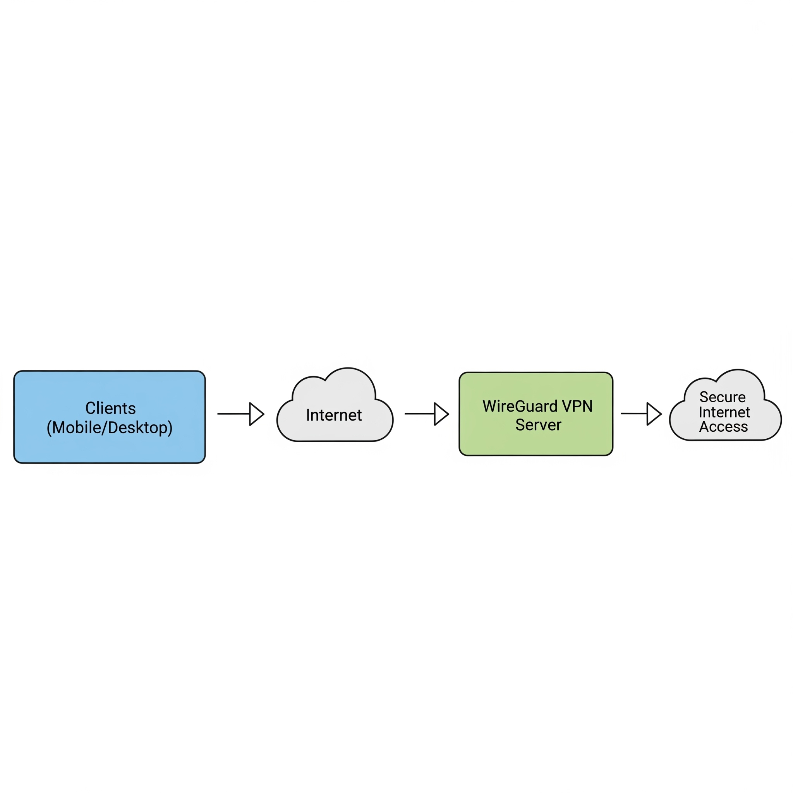

# 🛡️ Aegis-VPN

Aegis-VPN is my **personal VPN server project** built on top of [WireGuard](https://www.wireguard.com/).
It’s designed to give **secure remote access** without the “mystery box” feeling of commercial VPNs.
Everything is open, automated and documented so you can run it yourself.

While building this I ran into all sorts of small obstacles – missing dependencies on some VPSs, odd routing rules, QR code issues on mobile, and figuring out the safest defaults for WireGuard.
The current version already hides most of those pain-points for you, but you’ll still learn what’s happening under the hood.

---

## Features

- WireGuard VPN (fast, modern, secure)
- Automated server setup (`setup.sh`)
- Easy client addition (`add-client.sh`)
- Hardened server configuration
- Documentation & diagrams included

---

## Repository Structure
```
.
├── setup.sh              # Server setup script
├── add-client.sh         # Add client script
├── server/               # Server configs & hardening notes
├── clients/              # Client configs & onboarding guide
├── diagrams/             # Architecture & networking visuals
├── docs/                 # Documentation
└── LICENSE               # License file

```
---

## Quick Start

### 1. Setup Server
```bash
sudo ./setup.sh
```
- This installs WireGuard, sets up the server configuration and firewall rules automatically.

### 2. Add Clients

```bash
sudo ./add-client.sh <client-name>
```
- This generates a .conf file for the client.
- For mobile: scan the QR code displayed in your terminal with the WireGuard app.
- For desktop: import the .conf file.

- Scan QR code for mobile setup or import `.conf` on desktop.

### 3. Verify Connection

```bash
sudo wg show
ping 10.10.0.1
```

---

## Documentation

- `docs/why-wireguard.md` – Why WireGuard over OpenVPN/IPSec

- `docs/security-model.md` – Threat model & mitigations

 

 

---

## Roadmap

The following features are planned for the next release of Aegis-VPN:

- **Interactive Client Management**
  One unified script to add, remove, or list clients (no separate commands).

- **Auto QR Codes for Mobile Apps**
  After generating a client configuration, display a QR code that can be scanned directly in the WireGuard mobile app.

- **Unattended Install Mode**
  `setup.sh --auto` flag to run a fully non-interactive install for automated/cloud deployments.

- **IPv6 Support (Dual Stack)**
  Add IPv6 addresses to server and client configurations for dual-stack connectivity.

Contributions and suggestions are welcome!


## License

MIT License – see [LICENSE](LICENSE) file.
